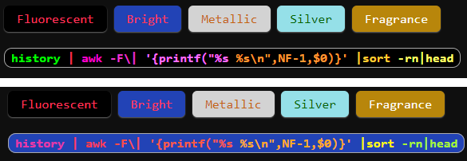

# Projects
[[site]]
<!-- vim-markdown-toc GitLab -->

* [Online Tools](#online-tools)
    * [code-tag-syntax-color.js](#code-tag-syntax-colorjs)
* [Contact](#contact)

<!-- vim-markdown-toc -->

# Online Tools
## code-tag-syntax-color.js
color html code tag block.

Go to [code-tag-syntax-color.js](projects/code-tag-syntax-color.html) 

- [BMI calculator](projects/BMI%20calculator.html) - calculate your BMI value.

# Contact

- [ZhiHau Github](https://github.com/zhihau)
- [ZhiHau Twitter](https://twitter.com/ZhihauShiu)
