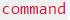

# Code tag syntax color
[[projects]]
<!-- vim-markdown-toc GitLab -->

* [Introduction](#introduction)
* [Play scheme](#play-scheme)
* [How to use code-tag-syntax-color.js](#how-to-use-code-tag-syntax-colorjs)
* [Color Schemes](#color-schemes)
    * [Fluorescent Color Scheme](#fluorescent-color-scheme)
    * [Bright Color Scheme](#bright-color-scheme)
    * [Metallic Color Scheme](#metallic-color-scheme)
    * [Silver Color Scheme](#silver-color-scheme)
    * [Fragrance Color Scheme](#fragrance-color-scheme)

<!-- vim-markdown-toc -->

# Introduction

When I add a code html tag for a , it has a boring color. So I extend the color to arguments of a command. And you can change the scheme. Likes `find / -name "vim"`. Cool!😁 You can click scheme buttons to change the code scheme.

# Play scheme
Click below button to change the code tag block scheme.

      <button style="color:#FF355E;background:#000000" onclick="changeScheme(this.innerText)">Fluorescent</button>
      <button style="color:#FF3855;background:#2243B6" onclick="changeScheme(this.innerText)">Bright</button>
      <button style="color:#C46210;background:lightgrey" onclick="changeScheme(this.innerText)">Metallic</button>
      <button style="color:darkgreen;background:#95E0E8" onclick="changeScheme(this.innerText)">Silver</button>
      <button style="color:#FEFEFA;background:darkgoldenrod" onclick="changeScheme(this.innerText)">Fragrance</button>
    

    
`history | awk -F\| '{printf("%s %s\n",NF-1,$0)}' |sort -rn|head`

# How to use code-tag-syntax-color.js

Add below script code before the close body tag.

<pre class="html">

</pre>

If you want to ignore some code section, add the selector name to ignore_selectors array. And place this code before the line that include code-tag-syntax-color.js

<pre class="html">

</pre>

Full example

<pre class="html">
<html>
<head>

</head>
<body>

The HTML <code>button</code> tag defines a clickable button.

</body>
</html>
</pre>

# Color Schemes
## Fluorescent Color Scheme

## Bright Color Scheme

## Metallic Color Scheme

## Silver Color Scheme

## Fragrance Color Scheme

