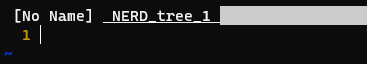
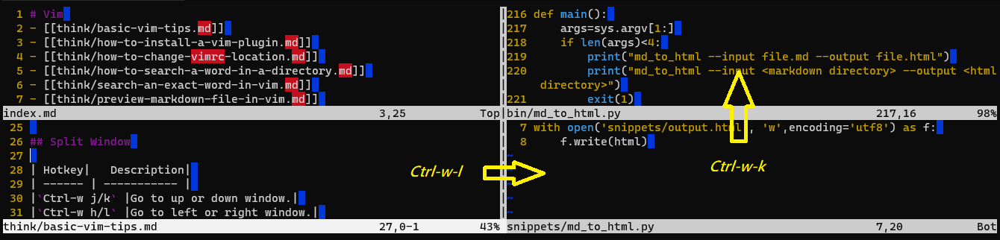
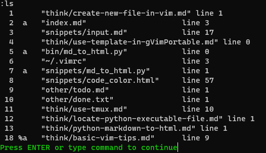

# Basic vim tips
[[vim]] [[tips]] [[hotkey]]
<!-- vim-markdown-toc GitLab -->

* [Regular expression](#regular-expression)
* [Tabs](#tabs)
* [Search](#search)
* [Split Window](#split-window)
* [Buffer](#buffer)
    * [Buffer mark](#buffer-mark)
* [Fold](#fold)
* [Why I create this document](#why-i-create-this-document)

<!-- vim-markdown-toc -->

## Regular expression

| Hotkey | Description|
| ------ | ----------- |
| `:g/abc.*xyz` |Try regular expression.|
| `:g/abc.*xyz/d` |Delete match lines.|

## Tabs

| Hotkey | Description|
| ------ | ----------- |
| `:Te`   |Open tab explorer. |
| `:tabs` |Show all tabs. |
| `gt`  |Go to next tab. |
| `gT`  |Go to previous tab. |
| `{i}gt`  |Go to **{i}** tab. Eg.`5gt` means go to the fifth tab. |
| `:tabclose {i}` |Close **{i}**th tab. |
| `:q` |Close current tab. |
| `:qa` |Close all tabs. |
| `vim -p *.css`  |Open all css files in tabs. |
| `vim -p hi.css test.css`  |Open files in tabs. |

## Search

| Hotkey|   Description|
| ------ | ----------- |
|`:vimgrep /vim/ *.wiki`|   Search word vim in wiki files. |
|`:vimgrep /\&lt;vim\&gt;/ *.wiki`| Search full word vim in wiki files.|
|`:cfirst`| Move to the first match.|
|`:clast`|  Move to the last match.|
|`:cprevious or cp`|    Move to the previous match.|
|`:cnext or cn `|   Move to the next match.|
|`:cl`| List all matches.|
|`/i`|  Find any word contains character i|
|`/\&lt;vim\&gt;`|  Find whole word match word|
|`n`|   Move to next match|
|`N`|   Move to previous match|

## Split Window

| Hotkey|   Description|
| ------ | ----------- |
|`Ctrl-w j/k` |Go to up or down window.|
|`Ctrl-w h/l` |Go to left or right window.|
|`Ctrl-w p`   |Go to previous window.|
|`Ctrl-w =`   |Set an equal size to the split windows.|
|`Ctrl-w +/-` |Increase/decrease height.|
|`Ctrl-w >/<` |Increase/decrease width.|
|`Ctrl-w _`   |Maximize height.|
|`Ctrl-w &#124;`|Maximize width.|
|`:sp or Ctrl-w-s`   |Split window. Which one press less key? `Ctrl-w-s`|
|`:vsp or Ctrl-w-v`   |Split window vertically.|

## Buffer

| Hotkey|   Description|
| ------ | ----------- |
|`:ls` |List all previous opened files.|
|`:b{i}` |Open {i} file.|
|`:bnext or :bn` |Open next buffer file.|
|`:bprevious or :bp` |Open previous buffer file.|
|`:blast or :bl` |Open last buffer file.|
|`:bfirst or :bf` |Open first buffer file.|

### Buffer mark

| Mark|   Description|
| ------ | ----------- |
|`-` |Inactive buffer.|
|`a` |Active buffer. The file is open for editing.|
|`h` |Hide buffer.|
|`%` |Current buffer. There is a cursor in this window.|
|`#` |Swap buffer.|
|`=` |Read only buffer.|
|`+` |Already modified buffer.|

## Fold

| Hotkey|   Description|
| ------ | ----------- |
|`zf` |Define a fold. Select lines then press `zf`.|
|`zo` |Open fold.|
|`zc` |Close fold.|
|`za` |Toggle fold.|

## Why I create this document
- When I create a vim document, I can review what I learned.
- Record what I use frequently.
